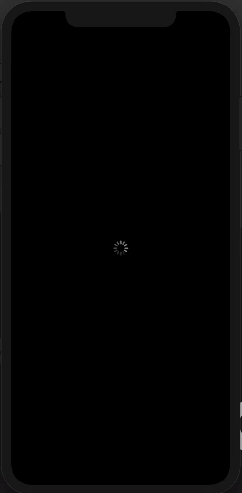

# GPA_Converter
### First iOS application built with Swift and Xcode!
This application is a simple but useful tool to convert the GPA given at McMaster University (12-Point scale) into a standardized GPA scale (4-Point Scale). Before, I used to calculate this all by hand by searching up conversion tables online, but now with this application I built I can simply and efficiently convert GPAs when I need to. 

### A Short Demonstration of the App:

